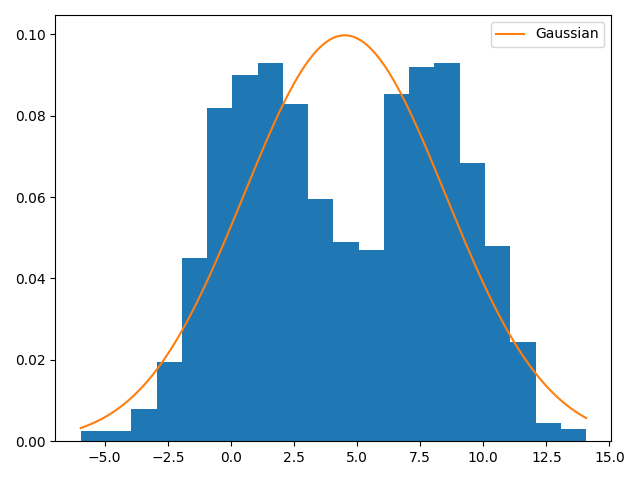

# EM-Algorithm
Live demo: https://colab.research.google.com/drive/18MbR-Gvcvq126hJ-tmkszqkHPHqOBRCb#scrollTo=z3F-zrCAar6i

References: 

[1] Roweis, Sam, and Zoubin Ghahramani. "A unifying review of linear Gaussian models." Neural computation 11.2 (1999): 305-345.

[2] https://www.kaggle.com/charel/learn-by-example-expectation-maximization